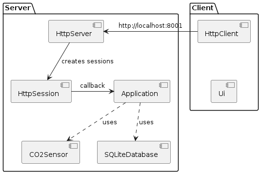

Client-Server app for monitoring CO2 in living room

## Dependencies

```
sudo apt install nlohmann-json3-dev libspdlog-dev libboost-system-dev libboost-filesystem-dev libsqlite3-dev
```

## Build steps

```
cd server && mkdir build && cd build 
cmake ..
cmake --build .
```

## Code formating

```
find . -type f \( -name '*.cpp' -or -name '*.hpp' \) -exec clang-format -i {} +
```

## General architecture

